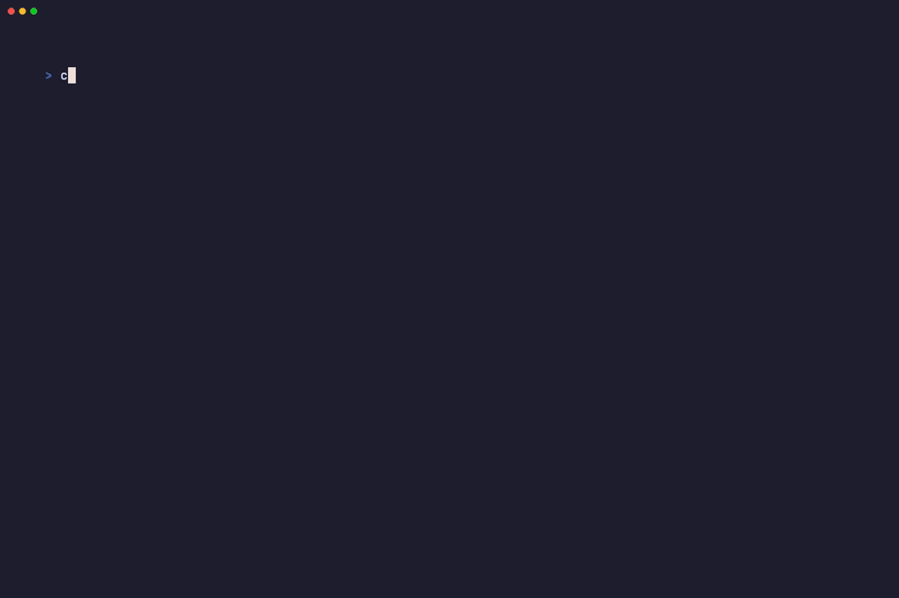

# Chronos ⏳



**Chronos** is a terminal-based benchmarking tool designed to test the runtime speed of AI systems. It specifically focuses on measuring token generation speed and analyzing the performance of agentic tasks, distinguishing between "thinking" time (LLM inference) and "acting" time (sandbox/tool execution).

## Features

- **Token Benchmarking**: Measure tokens per second (TPS).
  - Supports simulated benchmarks for quick testing.
  - **Real-world testing**: Integrated with the Anthropic SDK to measure actual performance (requires API key).
- **Agent Task Benchmarking**: Detailed breakdown of agent workflows:
  - **Thinking Time**: Duration the LLM takes to plan or generate tool calls.
  - **Tool Execution**: Time spent executing actions in the sandbox (e.g., WebSearch, WebFetch).
  - **Overhead**: System latency and setup time.
- **Environment Comparison**: Compare performance metrics across different runtime environments:
  - Local (Puppeteer/Playwright)
  - Cloud Infrastructure (Browserbase)
- **Resources**: Built-in command to access curated reading materials on AI benchmarking and browser infrastructure.

## Installation

```bash
git clone <repository-url>
cd chronos
npm install
npm run build
```

## Usage

### Run Benchmarks
Execute the main benchmark suite to test both token generation and agent tasks:

```bash
# Using npm
npm start -- benchmark

# Or using the linked command (after npm link)
chronos benchmark
```

### View Resources
Access a list of recommended readings and tools:

```bash
npm start -- resources
```

### Real Token Benchmarking
To test with real models via Groq, configure your `.env` file:

1. Copy the environment example file:
   ```bash
   cp .env.example .env
   ```

2. **Add your Groq API key**:
   ```env
   GROQ_API_KEY=gsk_...
   ```

3. Run the benchmark command:
   ```bash
   npm start -- benchmark --model groq:llama-3.3-70b-versatile
   ```

## Recording Demos
Chronos includes a [VHS](https://github.com/charmbracelet/vhs) tape configuration for recording terminal demos.

```bash
vhs demo.tape
```

## Tech Stack
- **Runtime**: Node.js & TypeScript
- **CLI**: Commander.js
- **Thinking**: [Vercel AI SDK](https://sdk.vercel.ai/) with [Groq](https://groq.com/)
- **Acting**: [Playwright](https://playwright.dev/)
- **Styling**: Chalk & Ora
